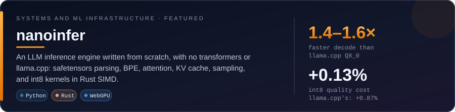
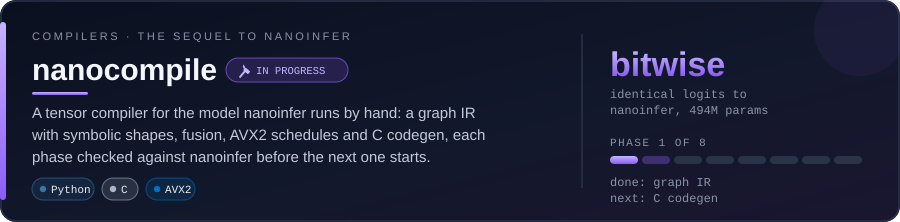
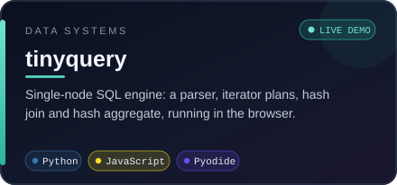
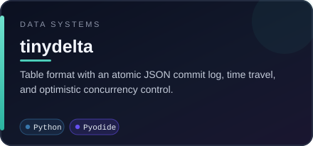
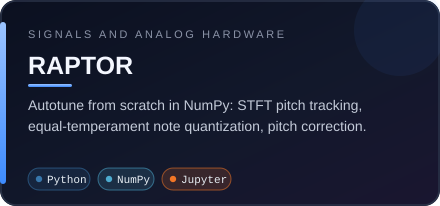
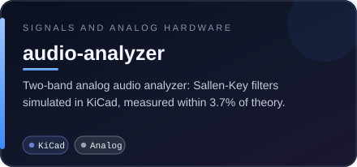
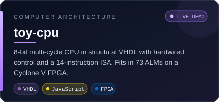
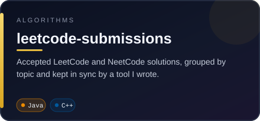

  

## Languages and tools

## Projects

  

  

  
  

  
  

  
  

  Live demos: <a href="https://spookyjumpybeans.github.io/tinyquery/">tinyquery</a> &nbsp;·&nbsp; <a href="https://spookyjumpybeans.github.io/toy-cpu/">toy-cpu simulator</a>

